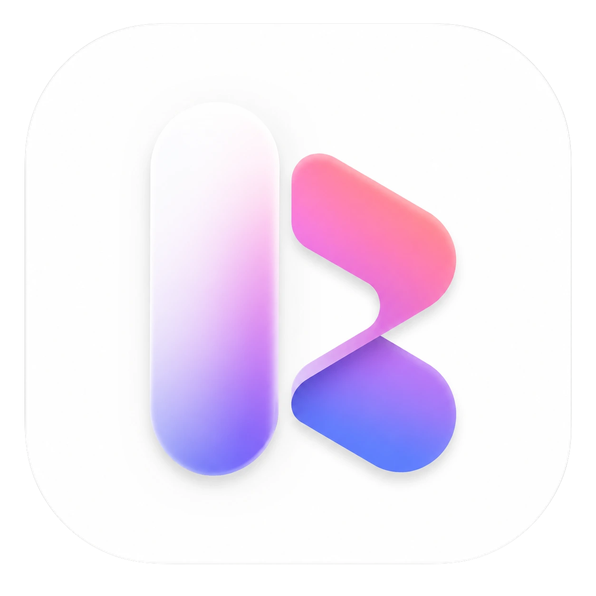

<div align="center">



### Reachly

Platform Manajemen Kerja Sama Influencer/KOL & Campaign ROI Analytics

[](https://codecov.io/gh/mrizalbasri/reachly)
[](https://www.typescriptlang.org/)
[](https://tanstack.com/start)
[](https://tailwindcss.com/)

</div>

---

## 📌 Ringkasan Produk

**Reachly** adalah web app terpadu untuk memusatkan seluruh siklus kerja sama dengan Key Opinion Leaders (KOL) / Influencer — dari riset pencarian kandidat, pelacakan status negosiasi via Kanban board, alokasi anggaran kampanye real-time, hingga analisis efisiensi ROI (CPM, CPE, CPV) secara otomatis.

---

## ✨ Fitur Utama

- **Direktori KOL Terpusat** — Pencarian & filter KOL berdasarkan Niche, Followers, Engagement Rate, dan Rate Card (IDR).
- **Pipeline Prospek (Kanban Board)** — Pelacakan alur negosiasi interaktif dari Prospek, Outreach, Nego, Deal, Posting hingga Selesai.
- **Manajemen Kampanye & Budget** — Pemantauan alokasi anggaran kampanye dan sisa dana secara real-time.
- **Analisis Performa & ROI** — Penghitungan otomatis metrik CPM, CPE, dan CPV beserta papan peringkat efisiensi KOL.
- **Ekspor Laporan Lanjutan** — Cetak dokumen PDF serta ekspor data ke Excel (.xlsx) dan CSV.
- **Autentikasi Multi-Tenant** — Integrasi Clerk Authentication & Clerk Organizations.

---

## 🏗️ Arsitektur Ringkas

```
┌─────────────────────────────────────────────────────────┐
│                    Browser Client                       │
│    TanStack Start (React 19) + Tailwind CSS v4          │
└────────────────────────────┬────────────────────────────┘
                             │ HTTPS / Server Functions
┌────────────────────────────▼────────────────────────────┐
│              TanStack Start Server Layer                │
│    - Business Logic & Zod Schema Validation             │
│    - Clerk Authentication & Multi-Tenant Session        │
└────────────────────────────┬────────────────────────────┘
                             │ Drizzle ORM
┌────────────────────────────▼────────────────────────────┐
│                 PostgreSQL Database                     │
└─────────────────────────────────────────────────────────┘
```

---

## 🛠️ Tech Stack

| Layer | Teknologi |
| --- | --- |
| **Framework** | TanStack Start (React 19) |
| **Routing** | TanStack Router (Type-Safe) |
| **Styling** | Tailwind CSS v4 & Lucide Icons |
| **Database & ORM** | Drizzle ORM & PostgreSQL |
| **Autentikasi** | Clerk (`@clerk/tanstack-react-start`) |
| **Testing & CI/CD** | Vitest & Codecov (GitHub Actions) |
